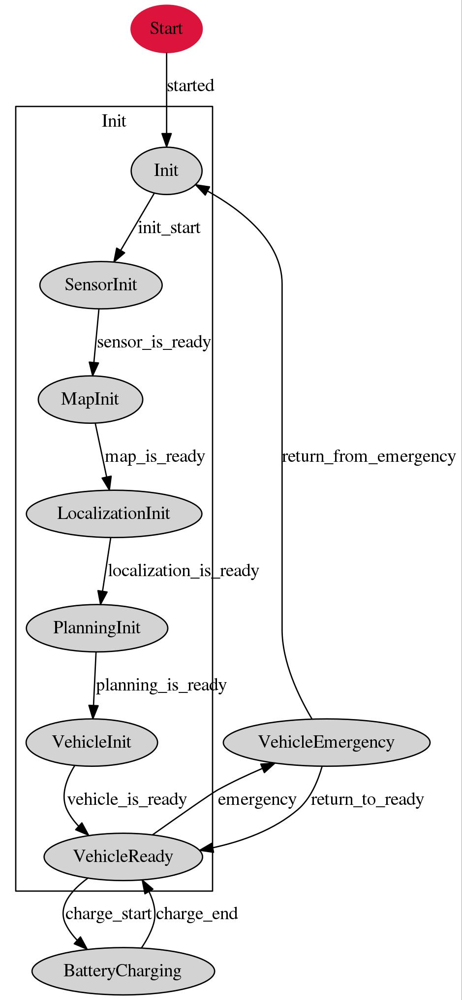

# Decision Maker

## Overview
**This feature is experimental.** 
Autoware package based state machine.
<!-- Autoware package that visualize internal state and publish some commands. -->
### Vehicle

## Runtime Manager Parameters
Parameter|Type|Description
--|---|--
auto_mission_reload|Bool|(default: *false*) If this is set true, decision maker automatically reloads mission as new mission after previous mission is completed.
auto_engage|Bool|(default: *false*) If this is set true, decision maker automatically engage immediately after ready to drive.
auto_mission_change|Bool|(default: *false*) If this is set true, decision maker automatically change the mission(waypoint) without state_cmd when new mission is loaded while driving.
use_fms|Bool|(default: *false*) This must be true in order to incoorporate with [Autoware Management System](https://github.com/CPFL/AMS)
disuse_vector_map|Bool|(default: *false*)  If set *true*, decision_maker will bypass loading a vector map on startup.
num_of_steer_behind|Int|(default: *20*)  lookup distance along waypoints to determine steering state(straight, turning right, or turning left)
change_threshold_dist|Double|(default: *1*)  This is relevent only if *use_fms* is *true*.  If the distance from vehicle to closest waypoint in the new mission is further than *change_threshold_dist* [m], mission change fails.
change_threshold_angle|Double|(default:*15*) This is relevent only if *use_fms* is *true*.  If the angle from vehicle to closest waypoint in the new mission is further than this *change_threshold_dist* [deg], mission change fails.
time_to_avoidance|Double|(default: *3*)  If the vehicle is stuck for *time_to_avoidance* seconds (e.g. due to obstacles), the state transits to from "Go" to "Avoidance".
goal_threshold_dist|Double|(default: *3*)  Threshold used to check if vehicle has reached to the goal (i.e. end of waypoints). The vehicle must be less than *goal_threshold_dist* [m] to the goal.
goal_threshold_vel|Double|(default: *0.1*)  Threshold used to check if vehicle has reached to the goal (i.e. end of waypoints). The vehicle must be less than *goal_threshold_vel* [m/s] to be treated as goal arrival.

## ROS Parameters
Parameter|Type|Description
--|---|--
state_vehicle_file_name|string|file that defines vehicle state transition
state_mission_file_name|string|file that defines mission state transition
state_behavior_file_name|string|file that defines behavior state transition
state_motion_file_name|string|file that defines motion state transition
stopline_reset_count|int|This parameter is used if the vehicle stops at the stop line and moves backward without crossing the stop line. When the vehicle moves backward by this count of the waypoints, the stop line is recognized again.

## Subscribed topics
Topic|Type|Objective
--|---|--
/based/lane_waypoints_array|autoware_msgs/LaneArray|waypoints for the vehicle to follow. (e.g. waypoints given from waypoint_loader node)
/change_flag|std_msgs/Int32|Vehicle will try to change lane if this flag is set. Publishes /lamp_cmd to change blinkers according to this flag. (0=straight, 1=right, 2=left)
/closest_waypoint|std_msgs/Int32|Closest waypoint index in waypoints given by /based/lane_waypoints_array.
/config/decision_maker|autoware_config_msgs::ConfigDecisionMaker|Parameters set from runtime manager
/current_pose|geometry_msgs/PoseStamped|Current pose of vehicle
/current_velocity|geometry_msgs/TwistStamped|Current velocity of vehicle
/filtered_points|sensor_msgs/PointCloud2|Used to check if sensor data is ready. This is meant to give pointcloud data used for ndt_matching.
/final_waypoints|autoware_msgs/Lane|resultant waypoints from planner nodes, e.g. from velocity_set node.
/obstacle_waypoint|std_msgs/Int32|Obstacle waypoint index. Used in "Go" state.
/state_cmd|std_msgs/String|Decision_maker will try to transit state according to the key given through this topic.
/state/stop_order_wpidx|std_msgs/Int32|Vehicle will try to stop at this index of waypoint. Used in "OrderedStop" state.
/vector_map_info/area|vector_map_msgs/AreaArray|Area information from vector map.  This is ignored unless area, cross_road, line, point, road_sign, stop_line, and vector are subscribed.
/vector_map_info/cross_road|vector_map_msgs/CrossRoadArray|Cross road information from vector map.  This is ignored unless area, cross_road, line, point, road_sign, stop_line, and vector are subscribed.
/vector_map_info/line|vector_map_msgs/LineArray|Line information from vector map.  This is ignored unless area, cross_road, line, point, road_sign, stop_line, and vector are subscribed.
/vector_map_info/point|vector_map_msgs/PointArray|Point information from vector map. This is ignored unless area, cross_road, line, point, road_sign, stop_line, and vector are subscribed.  
/vector_map_info/road_sign|vector_map_msgs/RoadSignArray|Road sign information from vector map.  This is ignored unless area, cross_road, line, point, road_sign, stop_line, and vector are subscribed.
/vector_map_info/stop_line|vector_map_msgs/StopLineArray|Stop line information from vector map. This is ignored unless area, cross_road, line, point, road_sign, stop_line, and vector are subscribed.
/vector_map_info/vector|vector_map_msgs/VectorArray|Vector information from vector map.  This is ignored unless area, cross_road, line, point, road_sign, stop_line, and vector are subscribed.

## Published topics
Topic|Type|Objective
--|---|--
/decision_maker/available_transition|std_msgs/String|available transition from current state
/decision_maker/operator_help_text|jsk_rviz_plugins/OverlayText|Help message during operation
/decision_maker/state|std_msgs/String|current state for "Vehicle", "Mission", and "Drive" state machine.
/decision_maker/state_msg|autoware_msgs/State|current state for "Vehicle", "Mission", and "Drive" state machine with header.
/lamp_cmd|autoware_msgs/LampCmd|blinker command to vehicle (0=straight, 1=right, 2=left)
/lane_waypoints_array|autoware_msgs/LaneArray|waypoints passed down to following planners. (e.g. lane_rule)
/light_color_managed|autoware_msgs/TrafficLight|meant to publish light_color status. Not implemented yet.
/decision_maker/state_overlay|jsk_rviz_plugins/OverlayText|Current state as overlay_txt.
/state/stopline_wpidx|std_msgs/Int32|Index of waypoint for the vehicle to stop.
/decision_maker/target_velocity_array|std_msgs/Float64MultiArray| Array of target velocity obtained from final_waypoints.
/stop_location|autoware_msgs/VehicleLocation|Feedback to fms on the `/state_stop_order_wpidx` topic. It contains the index that the vehicle will stop and the id of the lane_array that the vehicle is using at the time.

## State Description
### Vehicle States
State name|Required topic|Description|Implementation
--|--|---|--
Init|-|The parent state of the following states.|-
SensorInit|/filtered_points|Waits until all sensors are ready.|Waits until /filtered_points is received unless wf_simulator node is launched.  
LocalizationInit|/current_pose|Waits until localizer is ready | Waits until current_pose is converged. (i.e. ndt_matching is stable.)
PlanningInit|/closest_waypoint|Waits unil planners are ready | Subscriber is set for /closest_waypoint.
VehicleInit|-|Waits until vehicle is ready for departure.|No implementation goes directly to vehilce ready state.
VehicleReady|-|Vehicle is ready to move.|Exits to VehicleEmergency when `emergency` key is given by state_cmd from other states, or if `emergency_flag` is set true by other states.
BatteryCharging|-|Charging the battery|Waits until `charging_end` key by state_cmd from other nodes(e.g. by AMS).
VehicleEmergency|-|Emergency is detected somewhere in the system. |Waits until `return_from_emergency` or `return_to_ready`  key is by /state_cmd (e.g. by DecisionMakerPanel)

